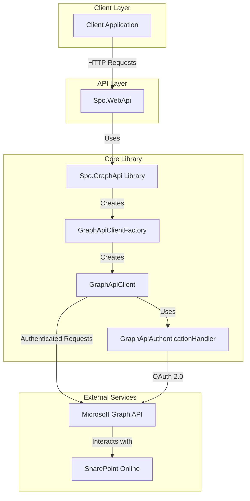

# SharePoint Online File Operations using Microsoft Graph API

This .NET 9 project demonstrates how to perform file operations in SharePoint Online using the Microsoft Graph API with OAuth 2.0 authentication and delegated access. The application facilitates seamless file interactions, leveraging modern authentication techniques and the capabilities of the Graph API.

## What is Microsoft Graph API?

Microsoft Graph API is a unified API endpoint that provides access to Microsoft 365 data and intelligence. It serves as a single endpoint (`https://graph.microsoft.com`) to access data across various Microsoft services including SharePoint, OneDrive, Outlook, Teams, and more. Key advantages include:

- **Unified Access** - A single API to access data across multiple Microsoft services
- **Consistent Data Model** - Standardized entities and relationships
- **Rich SDK Support** - Official SDKs for .NET, JavaScript, Java, Python, and more
- **Modern Authentication** - OAuth 2.0 and OpenID Connect support
- **Intelligence & Insights** - AI-powered features and analytics

In this project, we leverage Microsoft Graph API to interact with SharePoint Online document libraries and files.

## Features
- OAuth 2.0 authentication with delegated access
- File operations on SharePoint Online, such as:
  - Uploading files
  - Downloading files
  - Deleting files
  - Listing files
  - Updating file metadata
- Easy-to-use interface for managing files in SharePoint document libraries
- Distributed caching for improved performance

## Prerequisites

Before running the application, ensure you have the following:

- A Microsoft 365 tenant with SharePoint Online enabled
- Azure Active Directory (AAD) App Registration with:
  - Client ID
  - Tenant ID
  - Client Secret
  - Redirect URI configured for OAuth 2.0 authentication
- API Permissions granted in Azure AD App Registration:
  - `Sites.ReadWrite.All` - Required for accessing and modifying SharePoint sites
  - `Files.ReadWrite.All` - Required for file operations
- Development environment:
  - Visual Studio 2022 or later
  - .NET 9 SDK installed
  - (Optional) Bruno API client for testing

### Setting Up Azure AD Application

1. Go to [Azure Portal](https://portal.azure.com/) and navigate to **Azure Active Directory**
2. Select **App registrations** and click **New registration**
3. Enter a name for your application and select the appropriate account type
4. Set the Redirect URI to your application's callback URL
5. Click **Register**
6. Navigate to **API permissions** and add the following permissions:
   - Microsoft Graph API > Application permissions > Sites.ReadWrite.All
   - Microsoft Graph API > Application permissions > Files.ReadWrite.All
7. Click **Grant admin consent** for these permissions
8. Navigate to **Certificates & secrets** and create a new client secret
9. Note down the Client ID, Tenant ID, and Client Secret for configuration

## Getting Started

### 1. Clone the Repository
```bash
git clone https://github.com/nitin27may/sharepoint-graph-api
cd sharepoint-graph-api
```

### 2. Configure the Application
1. Open the `appsettings.json` file and update the placeholders with your Azure AD App Registration details:
    ```json
    {
    "GraphApiSettings": {
        "ClientId": "<YOUR-CLIENT-ID>",
        "TenantId": "<YOUR-TENANT-ID>",
        "ClientSecret": "<YOUR-CLIENT-SECRET>",
        "Scope": "https://graph.microsoft.com/.default ",
        "BaseGraphUri": "https://graph.microsoft.com/v1.0",
        "BaseSpoSiteUri": "<YOUR-BASE-SHAREPOINT-SITE-Name>.sharepoint.com"
        }
    }
    ```

### 3. Build and Run the Application
1. Open the project in Visual Studio.
2. Restore NuGet packages:
   ```bash
   dotnet restore
   ```
3. Build the solution:
   ```bash
   dotnet build
   ```
4. Run the application:
   ```bash
   dotnet run
   ```
Note: We are using [Bruno API client](https://www.usebruno.com/downloads) for the testing Rest API, the files are added in Api Collection Folder

### 4. Authenticate
- This project has `GraphApiCientFactory` which is handling the authentication.
- Upon successful authentication, the application will obtain an access token to interact with SharePoint Online via the Graph API.

## Usage

This section provides detailed instructions on how to use the API endpoints for SharePoint file operations.

### Understanding SharePoint Hierarchy

In SharePoint Online, the hierarchy is:
- **Site**: A collection of document libraries and other content
- **Drive**: A document library within a site (e.g., "Documents")
- **Path**: The location within a drive where files are stored

### Important Notes

- Use `root` as the `siteName` parameter if you are using the base SharePoint Online site.
- The default document library name in SharePoint is usually "Documents".
- File paths are relative to the drive root and should not include a leading slash.

### Available Operations

#### 1. List Files

Retrieves a list of files in a specified path within a document library.

```http
GET /api/graph/files?siteName={siteName}&driveName={driveName}&path={path}
```

**Parameters**:
- `siteName`: Name of the SharePoint site (use "root" for base site)
- `driveName`: Name of the document library (e.g., "Documents")
- `path`: Path within the library (e.g., "Folder1/SubFolder")

#### 2. Upload a File

Uploads a file to a specified path within a document library.

```http
POST /api/graph/files?siteName={siteName}&driveName={driveName}&path={path}
```

**Parameters**:
- `siteName`: Name of the SharePoint site
- `driveName`: Name of the document library
- `path`: Target path for the file
- Request body: Form data containing the file

#### 3. Download/Read a File

Retrieves file metadata or downloads the file.

```http
GET /api/graph/files/{fileName}?siteName={siteName}&driveName={driveName}&path={path}
```

**Parameters**:
- `fileName`: Name of the file to download
- `siteName`: Name of the SharePoint site
- `driveName`: Name of the document library
- `path`: Path to the file

#### 4. Delete a File

Deletes a file from a specified path.

```http
DELETE /api/graph/files/{fileName}?siteName={siteName}&driveName={driveName}&path={path}
```

**Parameters**:
- `fileName`: Name of the file to delete
- `siteName`: Name of the SharePoint site
- `driveName`: Name of the document library
- `path`: Path to the file

#### 5. Update File Metadata

Updates metadata of an existing file.

```http
PATCH /api/graph/files/{fileName}/metadata?siteName={siteName}&driveName={driveName}&path={path}
```

**Parameters**:
- `fileName`: Name of the file to update
- `siteName`: Name of the SharePoint site
- `driveName`: Name of the document library
- `path`: Path to the file
- Request body: JSON object with metadata key-value pairs

## Architecture and Code Flow

The application follows a layered architecture pattern with clear separation of concerns. Below is an architectural diagram of the codebase:



### Component Descriptions

1. **Client Application**: External applications that consume the API endpoints.

2. **Spo.WebApi**: ASP.NET Core Web API that exposes endpoints for SharePoint file operations. It acts as a façade over the core library.

3. **Spo.GraphApi Library**: Core library containing all the logic for interacting with Microsoft Graph API.

4. **GraphApiClientFactory**: Factory class responsible for creating instances of GraphApiClient with proper authentication.

5. **GraphApiClient**: Main class that handles all file operations by making authenticated requests to Microsoft Graph API.

6. **GraphApiAuthenticationHandler**: Handles OAuth 2.0 authentication with Azure AD and token management.

7. **Microsoft Graph API**: Microsoft's unified API endpoint that provides access to SharePoint data.

8. **SharePoint Online**: The destination service where files are stored and managed.

### Request Flow

1. The client sends an HTTP request to one of the endpoints in Spo.WebApi.
2. The controller in Spo.WebApi processes the request and calls the appropriate method in the Spo.GraphApi library.
3. The GraphApiClientFactory creates an authenticated instance of GraphApiClient.
4. GraphApiClient sends authenticated requests to Microsoft Graph API.
5. Microsoft Graph API interacts with SharePoint Online to perform the requested operation.
6. The response follows the same path back to the client.

## Technologies Used
- **.NET 9** - The latest version of the .NET framework
- **Microsoft Graph API** - Unified REST API for Microsoft 365 services
- **OAuth 2.0 Authentication** - Industry-standard protocol for authorization
- **Azure Active Directory** - Microsoft's cloud-based identity and access management service
- **SharePoint Online** - Cloud-based content management and collaboration platform
- **Distributed Caching** - For improved performance when accessing repeated resources
- **Bruno API Client** - For testing REST API endpoints

## Codebase Overview

This section provides insights into the key components of the codebase to help developers understand and extend the functionality.

### Project Structure

- **Spo.GraphApi**: Core library containing interfaces, models, and implementations for Graph API operations
  - `GraphApiClient.cs`: Main implementation of Graph API operations
  - `GraphApiClientFactory.cs`: Factory for creating authenticated clients
  - `GraphApiAuthenticationHandler.cs`: Handles OAuth 2.0 token acquisition
  - `Models/`: Contains data models used throughout the application

- **Spo.WebApi**: ASP.NET Core Web API exposing endpoints
  - `Controllers/GraphApiController.cs`: Exposes REST endpoints
  - `Program.cs`: Application startup and configuration
  - `appsettings.json`: Application settings including Graph API configuration

- **API Collection**: Bruno API client collections for testing
  - Contains pre-configured requests for all API operations

### Key Implementation Details

1. **Authentication Flow**
   - The application uses the Client Credentials OAuth 2.0 flow
   - `GraphApiClientFactory` handles authentication token acquisition and renewal
   - Tokens are cached to improve performance

2. **Performance Optimizations**
   - Site and drive information is cached using distributed caching
   - This reduces redundant calls to Microsoft Graph API

3. **Error Handling**
   - Custom exception types for Graph API-specific errors
   - Consistent error response format across all endpoints

4. **Extension Points**
   - The modular design allows for easy extension of functionality
   - Implement additional Graph API features by extending the `IGraphApiClient` interface

## Testing with Bruno API Client

This project includes a collection of API requests for testing with Bruno API client.

1. Install [Bruno API client](https://www.usebruno.com/downloads)
2. Open the `API Collection` folder in Bruno
3. Configure the environment variables in `environments/Local.bru`
4. Execute requests to test different endpoints

## Troubleshooting

### Common Issues

1. **Authentication Errors**
   - Verify Client ID, Tenant ID, and Client Secret in `appsettings.json`
   - Ensure proper permissions are granted in Azure AD

2. **File Operation Errors**
   - Check if the site, drive, and path parameters are correct
   - Verify that the SharePoint site is accessible

3. **Rate Limiting**
   - Microsoft Graph API has rate limits that may be encountered during heavy usage
   - Implement retry logic or backoff strategies for production use

## Contributing

Contributions are welcome! If you find a bug or have a feature request, feel free to open an issue or submit a pull request.

1. Fork the repository
2. Create your feature branch (`git checkout -b feature/amazing-feature`)
3. Commit your changes (`git commit -m 'Add some amazing feature'`)
4. Push to the branch (`git push origin feature/amazing-feature`)
5. Open a Pull Request

## License

This project is licensed under the MIT License. See the [LICENSE](LICENSE) file for details.

## Contact

For any inquiries or support, please contact [nitin27may@gmail.com](mailto:nitin27may@gmail.com).

---

Built with ❤️ using .NET 9 and Microsoft Graph API.

