# SharePoint Online File Operations using Microsoft Graph API

This .NET 10 project demonstrates how to perform file operations in SharePoint Online using the Microsoft Graph API with OAuth 2.0 authentication and application credentials. The application facilitates seamless file interactions, leveraging modern authentication techniques and the capabilities of the Graph API.

## Table of Contents

- [Features](#features)
- [Architecture and Code Flow](#architecture-and-code-flow)
- [Understanding the Code](#understanding-the-code)
- [Technologies Used](#technologies-used)
- [What is Microsoft Graph API?](#what-is-microsoft-graph-api)
- [Microsoft Graph API for SharePoint - Deep Dive](#microsoft-graph-api-for-sharepoint---deep-dive)
- [Prerequisites](#prerequisites)
- [Getting Started](#getting-started)
- [Usage](#usage)
- [API Reference](#api-reference)
- [Testing with Bruno API Client](#testing-with-bruno-api-client)
- [Troubleshooting](#troubleshooting)
- [Contributing](#contributing)
- [License](#license)

## Features

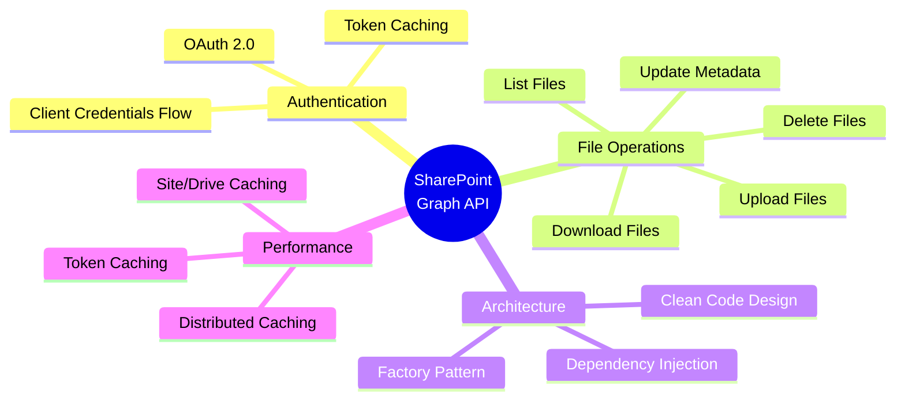
```mermaid
mindmap
  root((SharePoint<br/>Graph API))
    Authentication
      OAuth 2.0
      Client Credentials Flow
      Token Caching
    File Operations
      Upload Files
      Download Files
      Delete Files
      List Files
      Update Metadata
    Architecture
      Clean Code Design
      Factory Pattern
      Dependency Injection
    Performance
      Distributed Caching
      Site/Drive Caching
      Token Caching
```

### Key Features

- **OAuth 2.0 Authentication** - Secure authentication using Client Credentials flow
- **Complete File Operations** - Upload, download, delete, list, and update files in SharePoint
- **Metadata Management** - Update custom metadata properties on files
- **Performance Optimized** - Distributed caching for tokens, sites, and drives
- **Clean Architecture** - Factory pattern with dependency injection for testability
- **API Documentation** - Swagger/OpenAPI for easy API exploration

## Architecture and Code Flow

The application follows a layered architecture pattern with clear separation of concerns.

### High-Level Architecture

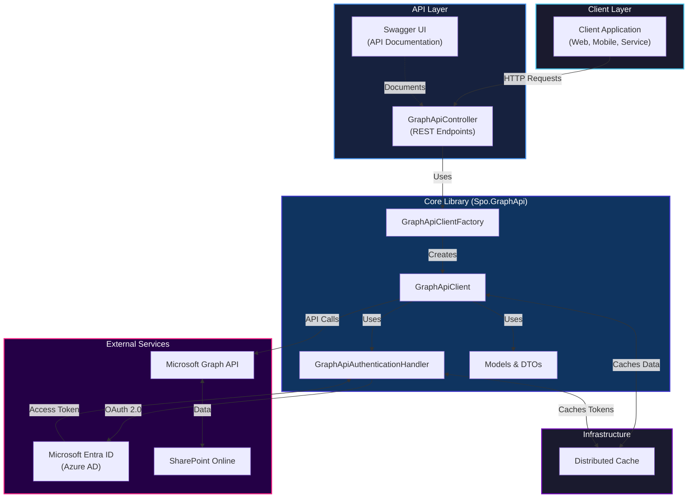
```mermaid
flowchart TB
    subgraph ClientLayer["Client Layer"]
        Client["Client Application<br/>(Web, Mobile, Service)"]
    end
    
    subgraph APILayer["API Layer"]
        Controller["GraphApiController<br/>(REST Endpoints)"]
        Swagger["Swagger UI<br/>(API Documentation)"]
    end
    
    subgraph CoreLibrary["Core Library (Spo.GraphApi)"]
        Factory["GraphApiClientFactory"]
        GraphClient["GraphApiClient"]
        AuthHandler["GraphApiAuthenticationHandler"]
        Models["Models & DTOs"]
    end
    
    subgraph Infrastructure["Infrastructure"]
        Cache["Distributed Cache"]
    end
    
    subgraph External["External Services"]
        AzureAD["Microsoft Entra ID<br/>(Azure AD)"]
        GraphAPI["Microsoft Graph API"]
        SharePoint["SharePoint Online"]
    end
    
    Client -->|"HTTP Requests"| Controller
    Swagger -.->|"Documents"| Controller
    Controller -->|"Uses"| Factory
    Factory -->|"Creates"| GraphClient
    GraphClient -->|"Uses"| AuthHandler
    GraphClient -->|"Uses"| Models
    GraphClient <-->|"Caches Data"| Cache
    AuthHandler <-->|"Caches Tokens"| Cache
    AuthHandler -->|"OAuth 2.0"| AzureAD
    AzureAD -->|"Access Token"| AuthHandler
    GraphClient -->|"API Calls"| GraphAPI
    GraphAPI <-->|"Data"| SharePoint
    
    style ClientLayer fill:#1a1a2e,stroke:#4cc9f0,stroke-width:2px,color:#fff
    style APILayer fill:#16213e,stroke:#4895ef,stroke-width:2px,color:#fff
    style CoreLibrary fill:#0f3460,stroke:#3f37c9,stroke-width:2px,color:#fff
    style Infrastructure fill:#1a1a2e,stroke:#7209b7,stroke-width:2px,color:#fff
    style External fill:#240046,stroke:#f72585,stroke-width:2px,color:#fff
```

### Request Lifecycle

The following sequence diagram illustrates a typical file operation request:

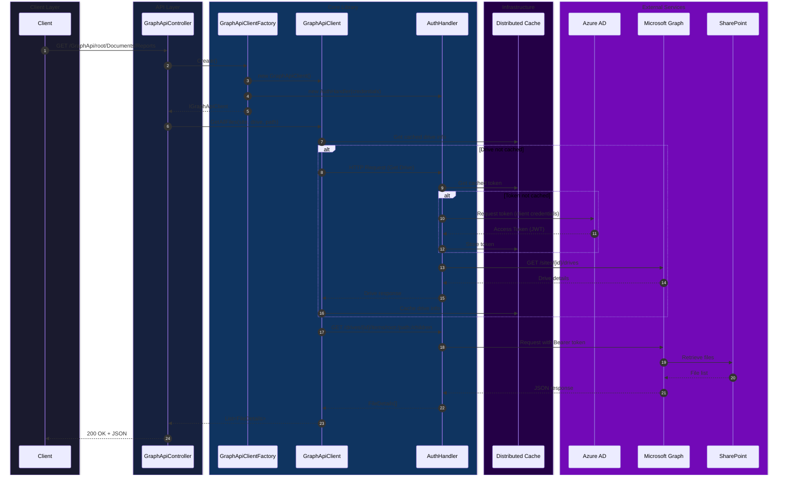
```mermaid
sequenceDiagram
    autonumber
    box rgb(26, 26, 46) Client Layer
        participant Client as Client
    end
    box rgb(22, 33, 62) API Layer
        participant Controller as GraphApiController
    end
    box rgb(15, 52, 96) Core Library
        participant Factory as GraphApiClientFactory
        participant GraphClient as GraphApiClient
        participant AuthHandler as AuthHandler
    end
    box rgb(36, 0, 70) Infrastructure
        participant Cache as Distributed Cache
    end
    box rgb(114, 9, 183) External Services
        participant AzureAD as Azure AD
        participant GraphAPI as Microsoft Graph
        participant SPO as SharePoint
    end

    Client->>Controller: GET /GraphApi/root/Documents/Reports
    Controller->>Factory: Create()
    Factory->>GraphClient: new GraphApiClient()
    Factory->>AuthHandler: new AuthHandler(credentials)
    Factory-->>Controller: IGraphApiClient
    
    Controller->>GraphClient: GetAllFiles(site, drive, path)
    GraphClient->>Cache: Get cached drive info
    
    alt Drive not cached
        GraphClient->>AuthHandler: HTTP Request (Get Drive)
        AuthHandler->>Cache: Get cached token
        alt Token not cached
            AuthHandler->>AzureAD: Request token (client credentials)
            AzureAD-->>AuthHandler: Access Token (JWT)
            AuthHandler->>Cache: Store token
        end
        AuthHandler->>GraphAPI: GET /sites/{id}/drives
        GraphAPI-->>AuthHandler: Drive details
        AuthHandler-->>GraphClient: Drive response
        GraphClient->>Cache: Cache drive info
    end
    
    GraphClient->>AuthHandler: GET /drives/{id}/items/root:/path:/children
    AuthHandler->>GraphAPI: Request with Bearer token
    GraphAPI->>SPO: Retrieve files
    SPO-->>GraphAPI: File list
    GraphAPI-->>AuthHandler: JSON response
    AuthHandler-->>GraphClient: FileDetails[]
    GraphClient-->>Controller: List<FileDetails>
    Controller-->>Client: 200 OK + JSON
```

### Component Interaction

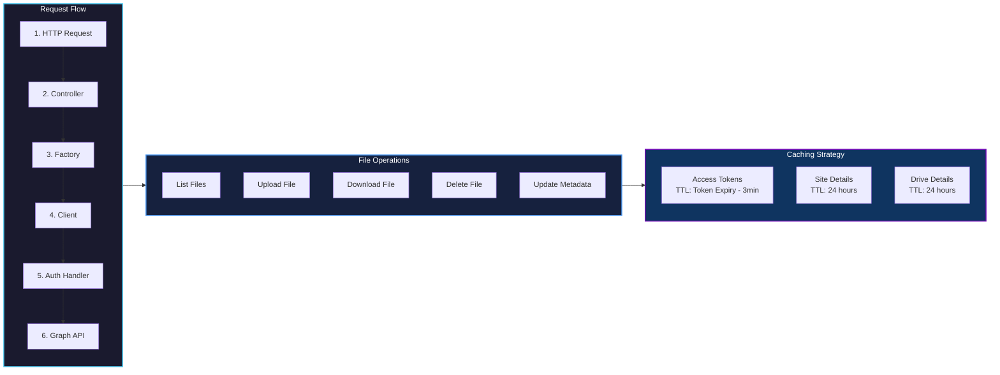
```mermaid
flowchart LR
    subgraph Request["Request Flow"]
        direction TB
        R1["1. HTTP Request"] --> R2["2. Controller"]
        R2 --> R3["3. Factory"]
        R3 --> R4["4. Client"]
        R4 --> R5["5. Auth Handler"]
        R5 --> R6["6. Graph API"]
    end
    
    subgraph Operations["File Operations"]
        direction TB
        O1["List Files"]
        O2["Upload File"]
        O3["Download File"]
        O4["Delete File"]
        O5["Update Metadata"]
    end
    
    subgraph Caching["Caching Strategy"]
        direction TB
        C1["Access Tokens<br/>TTL: Token Expiry - 3min"]
        C2["Site Details<br/>TTL: 24 hours"]
        C3["Drive Details<br/>TTL: 24 hours"]
    end
    
    Request --> Operations
    Operations --> Caching
    
    style Request fill:#1a1a2e,stroke:#4cc9f0,stroke-width:2px,color:#fff
    style Operations fill:#16213e,stroke:#4895ef,stroke-width:2px,color:#fff
    style Caching fill:#0f3460,stroke:#7209b7,stroke-width:2px,color:#fff
```

### Component Descriptions

| Component | Responsibility |
|-----------|---------------|
| **GraphApiController** | ASP.NET Core controller exposing REST endpoints, handles HTTP request/response |
| **GraphApiClientFactory** | Creates configured instances of `GraphApiClient` with authentication handler |
| **GraphApiClient** | Core implementation of all SharePoint file operations via Graph API |
| **GraphApiAuthenticationHandler** | HTTP delegating handler that automatically injects Bearer tokens |
| **Distributed Cache** | Caches access tokens and SharePoint site/drive information |

## Understanding the Code

This section explains how the code works to help developers extend or maintain the application.

### Project Structure

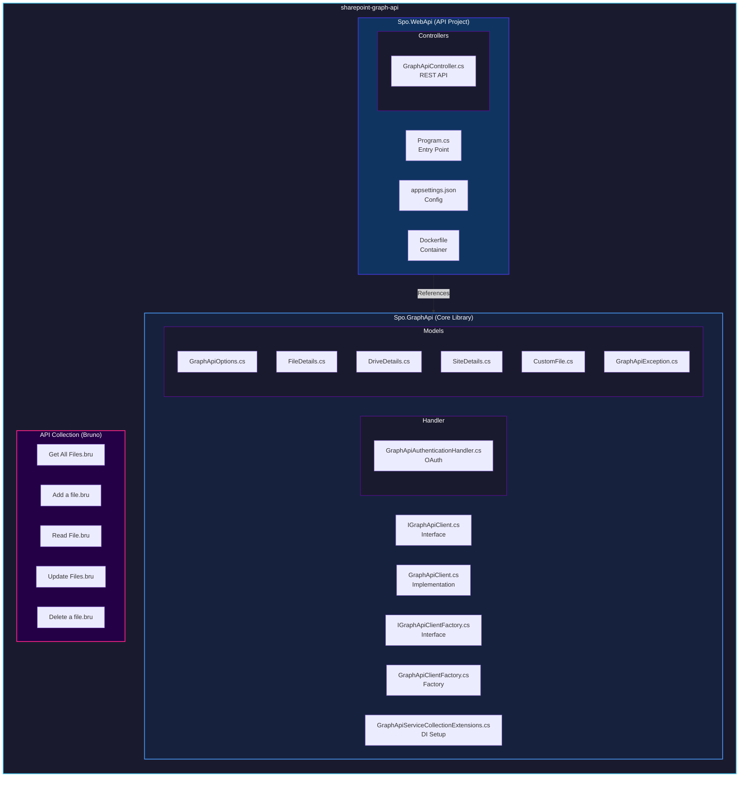
```mermaid
flowchart TB
    subgraph Solution["sharepoint-graph-api"]
        direction TB
        
        subgraph SpoGraphApi["Spo.GraphApi (Core Library)"]
            direction LR
            IClient["IGraphApiClient.cs<br/>Interface"]
            Client["GraphApiClient.cs<br/>Implementation"]
            IFactory["IGraphApiClientFactory.cs<br/>Interface"]
            Factory["GraphApiClientFactory.cs<br/>Factory"]
            Extensions["GraphApiServiceCollectionExtensions.cs<br/>DI Setup"]
            
            subgraph Handler["Handler"]
                Auth["GraphApiAuthenticationHandler.cs<br/>OAuth"]
            end
            
            subgraph Models["Models"]
                Options["GraphApiOptions.cs"]
                FileDetails["FileDetails.cs"]
                DriveDetails["DriveDetails.cs"]
                SiteDetails["SiteDetails.cs"]
                CustomFile["CustomFile.cs"]
                Exception["GraphApiException.cs"]
            end
        end
        
        subgraph SpoWebApi["Spo.WebApi (API Project)"]
            direction LR
            Program["Program.cs<br/>Entry Point"]
            Settings["appsettings.json<br/>Config"]
            Dockerfile["Dockerfile<br/>Container"]
            
            subgraph Controllers["Controllers"]
                ApiController["GraphApiController.cs<br/>REST API"]
            end
        end
        
        subgraph APICollection["API Collection (Bruno)"]
            direction LR
            GetAll["Get All Files.bru"]
            Add["Add a file.bru"]
            Read["Read File.bru"]
            Update["Update Files.bru"]
            Delete["Delete a file.bru"]
        end
    end
    
    SpoWebApi -->|"References"| SpoGraphApi
    
    style Solution fill:#1a1a2e,stroke:#4cc9f0,stroke-width:2px,color:#fff
    style SpoGraphApi fill:#16213e,stroke:#4895ef,stroke-width:2px,color:#fff
    style SpoWebApi fill:#0f3460,stroke:#3f37c9,stroke-width:2px,color:#fff
    style APICollection fill:#240046,stroke:#f72585,stroke-width:2px,color:#fff
    style Handler fill:#1a1a2e,stroke:#7209b7,stroke-width:1px,color:#fff
    style Models fill:#1a1a2e,stroke:#7209b7,stroke-width:1px,color:#fff
    style Controllers fill:#1a1a2e,stroke:#7209b7,stroke-width:1px,color:#fff
```

### Key Code Components Explained

#### 1. Authentication Handler (`GraphApiAuthenticationHandler.cs`)

The authentication handler is a `DelegatingHandler` that intercepts all HTTP requests and adds the Bearer token:

```csharp
protected override async Task<HttpResponseMessage> SendAsync(
    HttpRequestMessage request, 
    CancellationToken cancellationToken)
{
    // Get token (from cache or Azure AD)
    string accessToken = await GetAccessTokenAsync(cancellationToken);
    
    // Add Authorization header
    request.Headers.Authorization = new AuthenticationHeaderValue("Bearer", accessToken);
    
    // Continue with the request
    return await base.SendAsync(request, cancellationToken);
}
```

**Token Caching Strategy:**
- Tokens are cached in distributed cache
- Cache expiry is set to token expiry minus 3 minutes (safety margin)
- Uses `Azure.Identity` library's `ClientSecretCredential` for token acquisition

#### 2. Graph API Client (`GraphApiClient.cs`)

The client implements all file operations. Here's how it constructs Graph API URLs:

```csharp
// For listing files in a folder
var endpoint = $"drives/{driveId}/items/root:/{path}:/children?$select={selectQuery}";

// For uploading a file
var endpoint = $"drives/{driveId}/items/root:/{path}/{fileName}:/content";

// For deleting a file
var endpoint = $"drives/{driveId}/root:/{path}/{fileName}";
```

**Site and Drive Resolution:**
```csharp
// Site lookup pattern
// For root site:
"sites/{baseSpoSiteUri}"

// For named site:
"sites/{baseSpoSiteUri}:/sites/{siteName}"

// Drive lookup
"/sites/{siteId}/drives?$select=id,name,description,webUrl"
```

#### 3. Dependency Injection Setup

Register services in your application:

```csharp
// In Program.cs or Startup.cs
builder.Services.AddDistributedMemoryCache(); // Required for token caching
builder.Services.AddGraphApiServices(builder.Configuration);
```

The extension method registers:
```csharp
public static IServiceCollection AddGraphApiServices(
    this IServiceCollection services, IConfiguration config)
{
    services.Configure<GraphApiOptions>(
        config.GetSection(GraphApiOptions.GraphApiSettings));
    services.AddScoped<IGraphApiClientFactory, GraphApiClientFactory>();
    return services;
}
```

#### 4. Error Handling

Custom exceptions provide detailed error information:

```csharp
public class GraphApiException : Exception
{
    public HttpStatusCode HttpStatusCode { get; }
    public string ErrorMessage { get; }
    
    // Contains the full Graph API error response
}
```

### Extending the Application

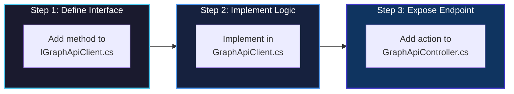
```mermaid
flowchart LR
    subgraph Step1["Step 1: Define Interface"]
        Interface["Add method to<br/>IGraphApiClient.cs"]
    end
    
    subgraph Step2["Step 2: Implement Logic"]
        Implementation["Implement in<br/>GraphApiClient.cs"]
    end
    
    subgraph Step3["Step 3: Expose Endpoint"]
        Endpoint["Add action to<br/>GraphApiController.cs"]
    end
    
    Step1 --> Step2 --> Step3
    
    style Step1 fill:#1a1a2e,stroke:#4cc9f0,stroke-width:2px,color:#fff
    style Step2 fill:#16213e,stroke:#4895ef,stroke-width:2px,color:#fff
    style Step3 fill:#0f3460,stroke:#3f37c9,stroke-width:2px,color:#fff
```

**Example: Adding Create Folder Operation**

1. **Add interface method** in `IGraphApiClient.cs`:
```csharp
Task<FolderDetails> CreateFolder(string siteName, string driveName, string path, 
    string folderName, CancellationToken cancellationToken = default);
```

2. **Implement in** `GraphApiClient.cs`:
```csharp
public async Task<FolderDetails> CreateFolder(string siteName, string driveName, 
    string path, string folderName, CancellationToken cancellationToken = default)
{
    var driveDetails = await GetDrive(siteName, driveName, cancellationToken);
    var endpoint = $"drives/{driveDetails.id}/items/root:/{path}/{folderName}";
    
    var folderData = new { 
        name = folderName, 
        folder = new { }, 
        "@microsoft.graph.conflictBehavior" = "rename" 
    };
    
    return await PostAsync<object, FolderDetails>(endpoint, folderData, cancellationToken);
}
```

3. **Add controller endpoint** in `GraphApiController.cs`

## Technologies Used

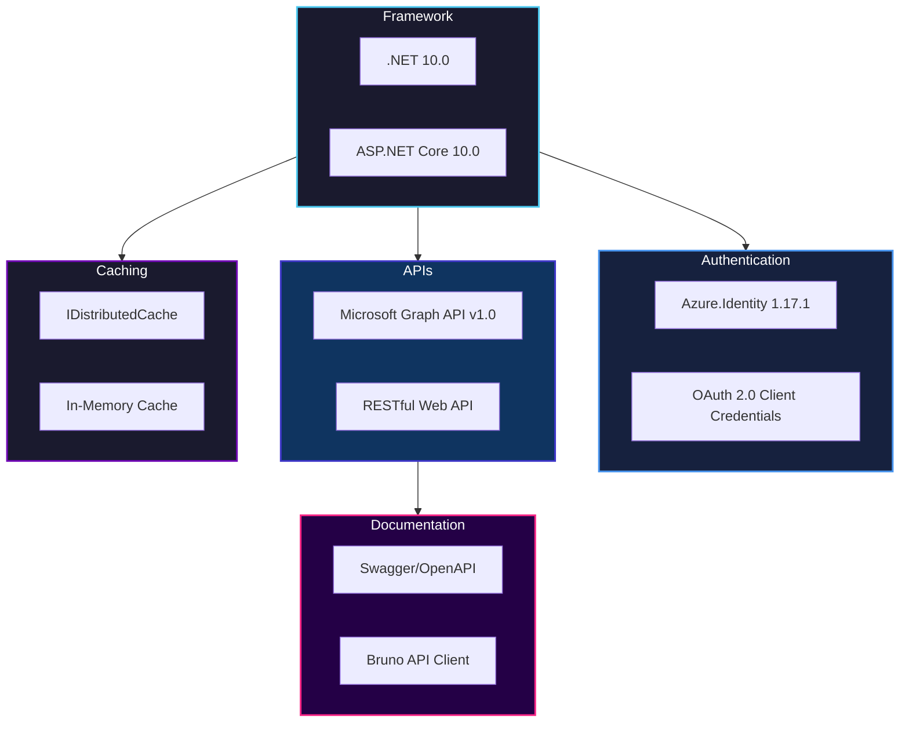
```mermaid
flowchart TB
    subgraph Framework["Framework"]
        NET[".NET 10.0"]
        ASPNET["ASP.NET Core 10.0"]
    end
    
    subgraph Authentication["Authentication"]
        AzureIdentity["Azure.Identity 1.17.1"]
        OAuth["OAuth 2.0 Client Credentials"]
    end
    
    subgraph APIs["APIs"]
        GraphAPI["Microsoft Graph API v1.0"]
        REST["RESTful Web API"]
    end
    
    subgraph Documentation["Documentation"]
        Swagger["Swagger/OpenAPI"]
        Bruno["Bruno API Client"]
    end
    
    subgraph Caching["Caching"]
        DistCache["IDistributedCache"]
        MemCache["In-Memory Cache"]
    end
    
    Framework --> Authentication
    Framework --> APIs
    Framework --> Caching
    APIs --> Documentation
    
    style Framework fill:#1a1a2e,stroke:#4cc9f0,stroke-width:2px,color:#fff
    style Authentication fill:#16213e,stroke:#4895ef,stroke-width:2px,color:#fff
    style APIs fill:#0f3460,stroke:#3f37c9,stroke-width:2px,color:#fff
    style Documentation fill:#240046,stroke:#f72585,stroke-width:2px,color:#fff
    style Caching fill:#1a1a2e,stroke:#7209b7,stroke-width:2px,color:#fff
```

| Technology | Version | Purpose |
|------------|---------|---------|
| **.NET** | 10.0 | Application framework |
| **ASP.NET Core** | 10.0 | Web API framework |
| **Azure.Identity** | 1.17.1 | Azure AD authentication |
| **Microsoft Graph API** | v1.0 | SharePoint access |
| **Distributed Caching** | Built-in | Token and data caching |
| **Swagger/OpenAPI** | 10.0.1 | API documentation |

## What is Microsoft Graph API?

Microsoft Graph API is a unified REST API endpoint that provides access to Microsoft 365 data and intelligence. It serves as a single entry point (`https://graph.microsoft.com`) to access data across various Microsoft services including SharePoint, OneDrive, Outlook, Teams, and more.

### Microsoft Graph API Overview

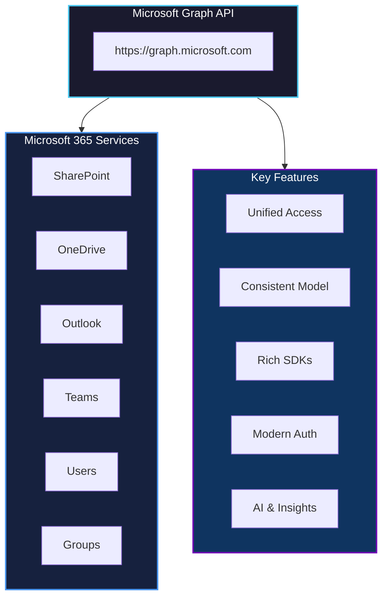
```mermaid
flowchart TB
    subgraph GraphAPI["Microsoft Graph API"]
        direction TB
        Endpoint["https://graph.microsoft.com"]
    end
    
    subgraph Services["Microsoft 365 Services"]
        direction LR
        SharePoint["SharePoint"]
        OneDrive["OneDrive"]
        Outlook["Outlook"]
        Teams["Teams"]
        Users["Users"]
        Groups["Groups"]
    end
    
    subgraph Features["Key Features"]
        direction LR
        Unified["Unified Access"]
        Consistent["Consistent Model"]
        SDK["Rich SDKs"]
        Auth["Modern Auth"]
        Intelligence["AI & Insights"]
    end
    
    GraphAPI --> Services
    GraphAPI --> Features
    
    style GraphAPI fill:#1a1a2e,stroke:#4cc9f0,stroke-width:2px,color:#fff
    style Services fill:#16213e,stroke:#4895ef,stroke-width:2px,color:#fff
    style Features fill:#0f3460,stroke:#7209b7,stroke-width:2px,color:#fff
```

### Key Advantages

| Feature | Description |
|---------|-------------|
| **Unified Access** | A single API to access data across multiple Microsoft services |
| **Consistent Data Model** | Standardized entities and relationships across all services |
| **Rich SDK Support** | Official SDKs for .NET, JavaScript, Java, Python, and more |
| **Modern Authentication** | OAuth 2.0 and OpenID Connect support with Azure AD |
| **Intelligence & Insights** | AI-powered features and analytics capabilities |

### Graph API Endpoint Structure

```
https://graph.microsoft.com/{version}/{resource}?{query-parameters}
```

- **Version**: `v1.0` (stable) or `beta` (preview features)
- **Resource**: The Microsoft 365 resource you're accessing (e.g., `sites`, `drives`, `users`)
- **Query Parameters**: OData query options like `$select`, `$filter`, `$expand`

## Microsoft Graph API for SharePoint - Deep Dive

This section provides a comprehensive understanding of how Microsoft Graph API interacts with SharePoint Online.

### SharePoint Resource Hierarchy

Understanding SharePoint's hierarchy is crucial for working with the Graph API:

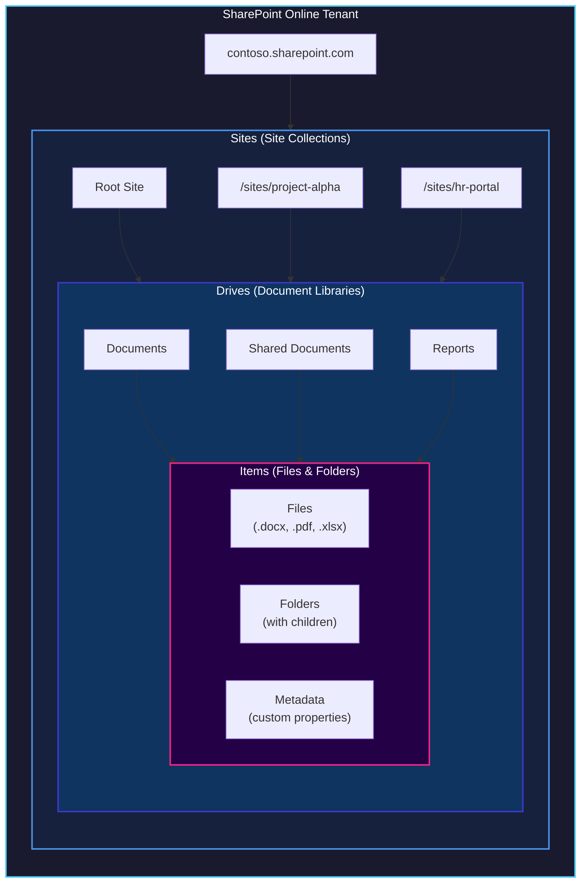
```mermaid
flowchart TB
    subgraph Tenant["SharePoint Online Tenant"]
        direction TB
        TenantURL["contoso.sharepoint.com"]
        
        subgraph Sites["Sites (Site Collections)"]
            direction TB
            RootSite["Root Site"]
            ProjectSite["/sites/project-alpha"]
            HRSite["/sites/hr-portal"]
            
            subgraph Drives["Drives (Document Libraries)"]
                direction TB
                Documents["Documents"]
                SharedDocs["Shared Documents"]
                Reports["Reports"]
                
                subgraph Items["Items (Files & Folders)"]
                    direction LR
                    Files["Files<br/>(.docx, .pdf, .xlsx)"]
                    Folders["Folders<br/>(with children)"]
                    Metadata["Metadata<br/>(custom properties)"]
                end
            end
        end
    end
    
    TenantURL --> Sites
    RootSite --> Drives
    ProjectSite --> Drives
    HRSite --> Drives
    Documents --> Items
    SharedDocs --> Items
    Reports --> Items
    
    style Tenant fill:#1a1a2e,stroke:#4cc9f0,stroke-width:2px,color:#fff
    style Sites fill:#16213e,stroke:#4895ef,stroke-width:2px,color:#fff
    style Drives fill:#0f3460,stroke:#3f37c9,stroke-width:2px,color:#fff
    style Items fill:#240046,stroke:#f72585,stroke-width:2px,color:#fff
```

### Key SharePoint Concepts in Graph API

#### 1. Sites
A **Site** represents a SharePoint site or site collection. You can access:
- **Root site**: The main SharePoint site (`contoso.sharepoint.com`)
- **Named sites**: Specific sites by path (`/sites/project-alpha`)

**Graph API Pattern:**
```
GET https://graph.microsoft.com/v1.0/sites/{hostname}:{site-path}
GET https://graph.microsoft.com/v1.0/sites/{site-id}
```

#### 2. Drives
A **Drive** represents a document library within a SharePoint site. Each site can have multiple drives (document libraries).

**Graph API Pattern:**
```
GET https://graph.microsoft.com/v1.0/sites/{site-id}/drives
GET https://graph.microsoft.com/v1.0/drives/{drive-id}
```

#### 3. Drive Items
**DriveItems** represent files and folders within a drive. Key operations include:
- List children of a folder
- Upload/download files
- Create folders
- Update metadata
- Delete items

**Graph API Pattern:**
```
GET https://graph.microsoft.com/v1.0/drives/{drive-id}/root:/path/to/item
GET https://graph.microsoft.com/v1.0/drives/{drive-id}/items/{item-id}
```

### Authentication Flow

This application uses the **Client Credentials OAuth 2.0 flow** for server-to-server authentication:

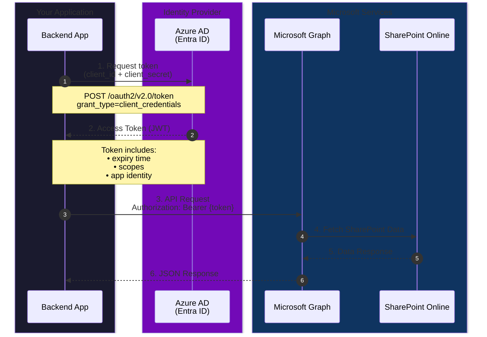
```mermaid
sequenceDiagram
    autonumber
    box rgb(26, 26, 46) Your Application
        participant App as Backend App
    end
    box rgb(114, 9, 183) Identity Provider
        participant AzureAD as Azure AD<br/>(Entra ID)
    end
    box rgb(15, 52, 96) Microsoft Services
        participant Graph as Microsoft Graph
        participant SPO as SharePoint Online
    end

    App->>AzureAD: 1. Request token<br/>(client_id + client_secret)
    Note over App,AzureAD: POST /oauth2/v2.0/token<br/>grant_type=client_credentials
    AzureAD-->>App: 2. Access Token (JWT)
    Note over AzureAD,App: Token includes:<br/>• expiry time<br/>• scopes<br/>• app identity
    
    App->>Graph: 3. API Request<br/>Authorization: Bearer {token}
    Graph->>SPO: 4. Fetch SharePoint Data
    SPO-->>Graph: 5. Data Response
    Graph-->>App: 6. JSON Response
```

### Graph API URL Patterns Used in This Project

| Operation | Graph API Endpoint | HTTP Method |
|-----------|-------------------|-------------|
| Get Site | `/sites/{hostname}:/sites/{siteName}` | GET |
| Get Drives | `/sites/{site-id}/drives` | GET |
| List Files | `/drives/{drive-id}/items/root:/{path}:/children` | GET |
| Upload File | `/drives/{drive-id}/items/root:/{path}/{filename}:/content` | PUT |
| Read File | `/drives/{drive-id}/items/root:/{path}/{filename}` | GET |
| Delete File | `/drives/{drive-id}/root:/{path}/{filename}` | DELETE |
| Update Metadata | `/drives/{drive-id}/root:/{path}/{filename}` | PATCH |

## Prerequisites

Before running the application, ensure you have the following:

### Requirements Overview

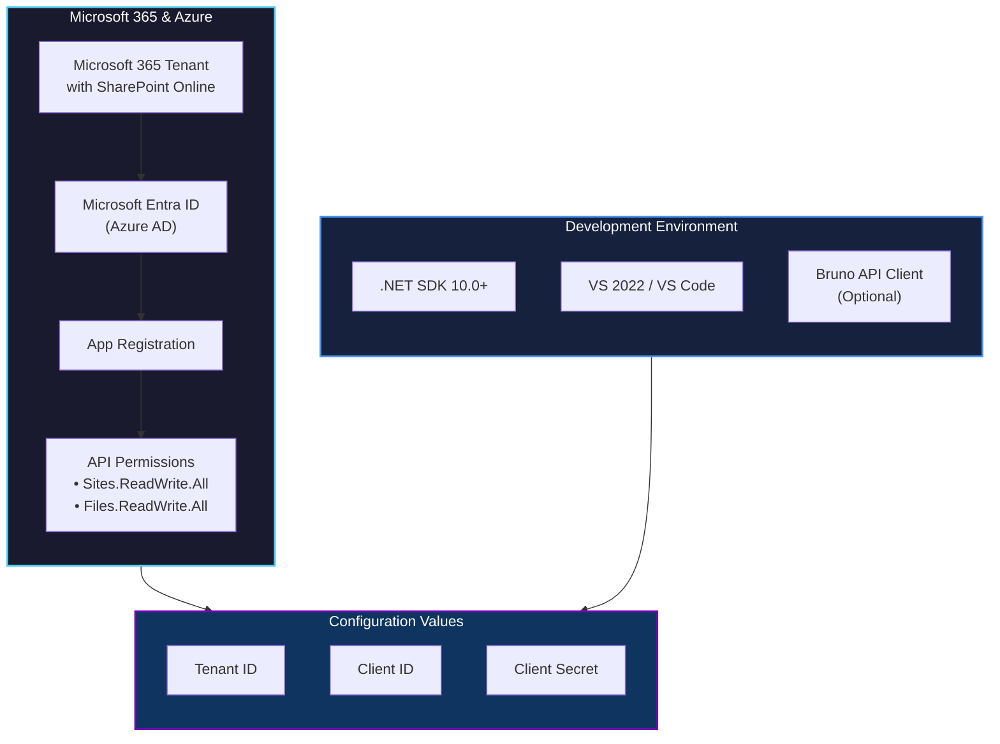
```mermaid
flowchart TB
    subgraph Azure["Microsoft 365 & Azure"]
        direction TB
        M365["Microsoft 365 Tenant<br/>with SharePoint Online"]
        EntraID["Microsoft Entra ID<br/>(Azure AD)"]
        AppReg["App Registration"]
        Perms["API Permissions<br/>• Sites.ReadWrite.All<br/>• Files.ReadWrite.All"]
        
        M365 --> EntraID
        EntraID --> AppReg
        AppReg --> Perms
    end
    
    subgraph Dev["Development Environment"]
        direction TB
        SDK[".NET SDK 10.0+"]
        IDE["VS 2022 / VS Code"]
        Bruno["Bruno API Client<br/>(Optional)"]
    end
    
    subgraph Config["Configuration Values"]
        direction TB
        TenantId["Tenant ID"]
        ClientId["Client ID"]
        Secret["Client Secret"]
    end
    
    Azure --> Config
    Dev --> Config
    
    style Azure fill:#1a1a2e,stroke:#4cc9f0,stroke-width:2px,color:#fff
    style Dev fill:#16213e,stroke:#4895ef,stroke-width:2px,color:#fff
    style Config fill:#0f3460,stroke:#7209b7,stroke-width:2px,color:#fff
```

### Microsoft 365 and Azure Requirements

- A Microsoft 365 tenant with SharePoint Online enabled
- Azure Active Directory (Entra ID) App Registration with:
  - **Client ID** (Application ID)
  - **Tenant ID** (Directory ID)
  - **Client Secret** (for server-to-server authentication)
- **API Permissions** granted in Azure AD App Registration:
  - `Sites.ReadWrite.All` - Required for accessing and modifying SharePoint sites
  - `Files.ReadWrite.All` - Required for file operations

### Development Environment

| Requirement | Version | Notes |
|-------------|---------|-------|
| .NET SDK | 10.0+ | [Download](https://dotnet.microsoft.com/download/dotnet/10.0) |
| Visual Studio | 2022 or later | Or VS Code with C# extension |
| Bruno API Client | Latest | Optional, for API testing |

### Setting Up Azure AD Application

Follow these steps to register your application in Azure AD (now called Microsoft Entra ID):

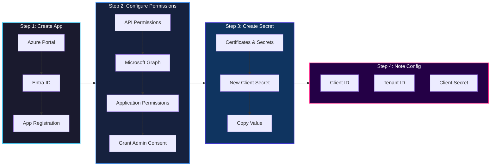
```mermaid
flowchart LR
    subgraph Step1["Step 1: Create App"]
        direction TB
        S1A["Azure Portal"]
        S1B["Entra ID"]
        S1C["App Registration"]
        S1A --> S1B --> S1C
    end
    
    subgraph Step2["Step 2: Configure Permissions"]
        direction TB
        S2A["API Permissions"]
        S2B["Microsoft Graph"]
        S2C["Application Permissions"]
        S2D["Grant Admin Consent"]
        S2A --> S2B --> S2C --> S2D
    end
    
    subgraph Step3["Step 3: Create Secret"]
        direction TB
        S3A["Certificates & Secrets"]
        S3B["New Client Secret"]
        S3C["Copy Value"]
        S3A --> S3B --> S3C
    end
    
    subgraph Step4["Step 4: Note Config"]
        direction TB
        S4A["Client ID"]
        S4B["Tenant ID"]
        S4C["Client Secret"]
    end
    
    Step1 --> Step2 --> Step3 --> Step4
    
    style Step1 fill:#1a1a2e,stroke:#4cc9f0,stroke-width:2px,color:#fff
    style Step2 fill:#16213e,stroke:#4895ef,stroke-width:2px,color:#fff
    style Step3 fill:#0f3460,stroke:#3f37c9,stroke-width:2px,color:#fff
    style Step4 fill:#240046,stroke:#f72585,stroke-width:2px,color:#fff
```

#### Step 1: Create App Registration

1. Go to [Azure Portal](https://portal.azure.com/)
2. Navigate to **Microsoft Entra ID** (formerly Azure Active Directory)
3. Select **App registrations** → **New registration**
4. Configure the registration:
   - **Name**: `SharePoint Graph API Client` (or your preferred name)
   - **Supported account types**: Single tenant (recommended for enterprise)
   - **Redirect URI**: Not required for client credentials flow
5. Click **Register**

#### Step 2: Configure API Permissions

1. In your app registration, go to **API permissions**
2. Click **Add a permission** → **Microsoft Graph**
3. Select **Application permissions** (not delegated)
4. Add these permissions:

   | Permission | Type | Description |
   |------------|------|-------------|
   | `Sites.ReadWrite.All` | Application | Read and write items in all site collections |
   | `Files.ReadWrite.All` | Application | Read and write files in all site collections |

5. Click **Grant admin consent for [Your Organization]**

> ⚠️ **Important**: Application permissions require admin consent and provide access to all sites in your tenant. For more granular access, consider using delegated permissions with user context.

#### Step 3: Create Client Secret

1. Go to **Certificates & secrets**
2. Under **Client secrets**, click **New client secret**
3. Add a description and select an expiration period
4. Click **Add**
5. **Copy the secret value immediately** - it won't be shown again!

#### Step 4: Note Your Configuration Values

After setup, you'll need these values for configuration:

```
Client ID:     xxxxxxxx-xxxx-xxxx-xxxx-xxxxxxxxxxxx
Tenant ID:     yyyyyyyy-yyyy-yyyy-yyyy-yyyyyyyyyyyy
Client Secret: your_secret_value_here
```

## Getting Started

### 1. Clone the Repository
```bash
git clone https://github.com/nitin27may/sharepoint-graph-api
cd sharepoint-graph-api
```

### 2. Configure the Application

Update the `Spo.WebApi/appsettings.json` file with your Azure AD App Registration details:

```json
{
  "GraphApiSettings": {
    "TenantId": "<YOUR-TENANT-ID>",
    "ClientId": "<YOUR-CLIENT-ID>",
    "SecretId": "<YOUR-CLIENT-SECRET>",
    "Scope": "https://graph.microsoft.com/.default",
    "BaseGraphUri": "https://graph.microsoft.com/v1.0",
    "BaseSpoSiteUri": "<YOUR-TENANT-NAME>.sharepoint.com"
  }
}
```

**Configuration Parameters Explained:**

| Parameter | Description | Example |
|-----------|-------------|---------|
| `TenantId` | Your Azure AD tenant ID (GUID) | `12345678-1234-1234-1234-123456789012` |
| `ClientId` | Application (client) ID from App Registration | `87654321-4321-4321-4321-210987654321` |
| `SecretId` | Client secret value (not the secret ID) | `abc123...` |
| `Scope` | OAuth scope for Microsoft Graph | `https://graph.microsoft.com/.default` |
| `BaseGraphUri` | Microsoft Graph API base URL | `https://graph.microsoft.com/v1.0` |
| `BaseSpoSiteUri` | Your SharePoint Online root URL | `contoso.sharepoint.com` |

> **Tip**: Use [User Secrets](https://learn.microsoft.com/en-us/aspnet/core/security/app-secrets) or environment variables in production to keep credentials secure.

### 3. Build and Run the Application

```bash
# Restore NuGet packages
dotnet restore

# Build the solution
dotnet build

# Run the Web API
cd Spo.WebApi
dotnet run
```

The API will be available at `https://localhost:7295` (or the configured port).

### 4. Access Swagger UI

Navigate to `https://localhost:7295/swagger` to explore and test the API endpoints interactively.

## Usage

This section provides detailed instructions on how to use the API endpoints for SharePoint file operations.

### Understanding SharePoint URL Structure

When working with this API, you need to understand how to address SharePoint resources:


```mermaid
flowchart LR
    subgraph URL["API URL Pattern"]
        direction LR
        Base["/GraphApi"]
        Site["{siteName}"]
        Drive["{driveName}"]
        Path["{path}"]
        File["{fileName}"]
        
        Base --> Site --> Drive --> Path --> File
    end
    
    subgraph Example["Example URL"]
        direction TB
        E1["/GraphApi/project-alpha/Documents/Reports/2024/quarterly-report.pdf"]
    end
    
    subgraph Mapping["URL Mapping"]
        direction TB
        M1["project-alpha -> Site Name"]
        M2["Documents -> Drive (Library)"]
        M3["Reports/2024 -> Folder Path"]
        M4["quarterly-report.pdf -> File Name"]
    end
    
    URL --> Example
    Example --> Mapping
    
    style URL fill:#1a1a2e,stroke:#4cc9f0,stroke-width:2px,color:#fff
    style Example fill:#16213e,stroke:#4895ef,stroke-width:2px,color:#fff
    style Mapping fill:#0f3460,stroke:#7209b7,stroke-width:2px,color:#fff
```

### SharePoint Resource Mapping

| API Parameter | SharePoint Concept | Example Values |
|--------------|-------------------|----------------|
| `siteName` | Site Collection Name | `root`, `project-alpha`, `hr-portal` |
| `driveName` | Document Library Name | `Documents`, `Shared Documents`, `Reports` |
| `path` | Folder Path within Library | `General`, `2024/Reports`, `Archive/Old` |
| `fileName` | File Name with Extension | `report.pdf`, `data.xlsx` |

### Important Notes

> **Root Site**: Use `root` as the `siteName` to access the main SharePoint site
> 
> **Default Library**: The default document library in SharePoint is usually `Documents`
> 
> **Path Format**: Paths are relative to the drive root, use forward slashes `/`

### API Response Format

All file operations return a consistent response format:

```json
{
  "id": "01XXXXXXXXXXXXXX",
  "name": "document.pdf",
  "size": 1024000,
  "webUrl": "https://contoso.sharepoint.com/sites/project-alpha/Documents/document.pdf",
  "createdDateTime": "2024-01-15T10:30:00Z",
  "lastModifiedDateTime": "2024-01-20T14:45:00Z",
  "file": {
    "mimeType": "application/pdf"
  },
  "parentReference": {
    "id": "01YYYYYYYYYYYYYY",
    "path": "/drives/drive-id/root:/FolderName"
  }
}
```

### Available Operations

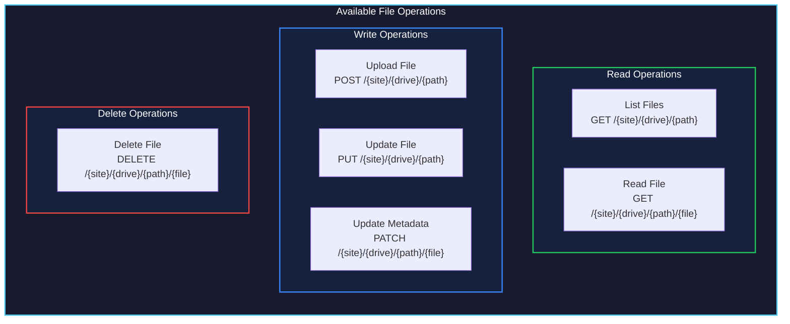
```mermaid
flowchart TB
    subgraph Operations["Available File Operations"]
        direction TB
        
        subgraph Read["Read Operations"]
            List["List Files<br/>GET /{site}/{drive}/{path}"]
            Get["Read File<br/>GET /{site}/{drive}/{path}/{file}"]
        end
        
        subgraph Write["Write Operations"]
            Upload["Upload File<br/>POST /{site}/{drive}/{path}"]
            Update["Update File<br/>PUT /{site}/{drive}/{path}"]
            Metadata["Update Metadata<br/>PATCH /{site}/{drive}/{path}/{file}"]
        end
        
        subgraph Delete["Delete Operations"]
            Remove["Delete File<br/>DELETE /{site}/{drive}/{path}/{file}"]
        end
    end
    
    style Operations fill:#1a1a2e,stroke:#4cc9f0,stroke-width:2px,color:#fff
    style Read fill:#16213e,stroke:#22c55e,stroke-width:2px,color:#fff
    style Write fill:#16213e,stroke:#3b82f6,stroke-width:2px,color:#fff
    style Delete fill:#16213e,stroke:#ef4444,stroke-width:2px,color:#fff
```

#### 1. List Files

Retrieves a list of files and folders in a specified path within a document library.

```http
GET /GraphApi/{siteName}/{driveName}/{path}?select={fields}
```

**Parameters:**

| Parameter | Location | Required | Description |
|-----------|----------|----------|-------------|
| `siteName` | Path | Yes | SharePoint site name (`root` for base site) |
| `driveName` | Path | Yes | Document library name |
| `path` | Path | Yes | Folder path within the library |
| `select` | Query | No | Comma-separated list of fields to return |

**Example Request:**
```http
GET /GraphApi/root/Documents/Reports?select=id,name,size,webUrl
```

**Example Response:**
```json
[
  {
    "id": "01ABCDEFG...",
    "name": "report-2024.pdf",
    "size": 2048000,
    "webUrl": "https://contoso.sharepoint.com/Documents/Reports/report-2024.pdf",
    "file": { "mimeType": "application/pdf" }
  },
  {
    "id": "01HIJKLMN...",
    "name": "Archives",
    "webUrl": "https://contoso.sharepoint.com/Documents/Reports/Archives",
    "folder": { "childCount": 5 }
  }
]
```

#### 2. Upload a File

Uploads a file to a specified path within a document library. Uses `multipart/form-data` encoding.

```http
POST /GraphApi/{siteName}/{driveName}/{path}
Content-Type: multipart/form-data
```

**Parameters:**

| Parameter | Location | Required | Description |
|-----------|----------|----------|-------------|
| `siteName` | Path | Yes | SharePoint site name |
| `driveName` | Path | Yes | Document library name |
| `path` | Path | Yes | Target folder path |
| `Name` | Form | Yes | Desired file name (extension auto-appended) |
| `File` | Form | Yes | The file to upload |

**Example cURL:**
```bash
curl -X POST "https://localhost:7295/GraphApi/root/Documents/Reports" \
  -F "Name=quarterly-report" \
  -F "File=@/path/to/report.pdf"
```

**Conflict Behavior:** If a file with the same name exists, a new version with a modified name is created (e.g., `report (1).pdf`).

#### 3. Read/Download a File

Retrieves file metadata. Use the `webUrl` from the response to download the actual file content.

```http
GET /GraphApi/{siteName}/{driveName}/{path}/{fileName}?select={fields}
```

**Parameters:**

| Parameter | Location | Required | Description |
|-----------|----------|----------|-------------|
| `siteName` | Path | Yes | SharePoint site name |
| `driveName` | Path | Yes | Document library name |
| `path` | Path | Yes | Folder path |
| `fileName` | Path | Yes | Name of the file |
| `select` | Query | No | Fields to return |

**Example Request:**
```http
GET /GraphApi/root/Documents/Reports/annual-report.pdf
```

#### 4. Update a File

Replaces an existing file's content. The file must already exist at the specified path.

```http
PUT /GraphApi/{siteName}/{driveName}/{path}
Content-Type: multipart/form-data
```

**Parameters:** Same as Upload operation.

#### 5. Delete a File

Permanently deletes a file from SharePoint.

```http
DELETE /GraphApi/{siteName}/{driveName}/{path}/{fileName}
```

**Parameters:**

| Parameter | Location | Required | Description |
|-----------|----------|----------|-------------|
| `siteName` | Path | Yes | SharePoint site name |
| `driveName` | Path | Yes | Document library name |
| `path` | Path | Yes | Folder path |
| `fileName` | Path | Yes | Name of the file to delete |

**Response:** `204 No Content` on success

#### 6. Update File Metadata

Updates custom metadata properties on a file.

```http
PATCH /GraphApi/{siteName}/{driveName}/{path}/{fileName}
Content-Type: application/json
```

**Request Body:**
```json
{
  "description": "Annual financial report",
  "department": "Finance"
}
```

> ⚠️ **Note**: Only supported metadata fields can be updated. Standard file properties like `name` can be updated, but custom columns require proper configuration in SharePoint.

## API Reference

### API Endpoints Overview

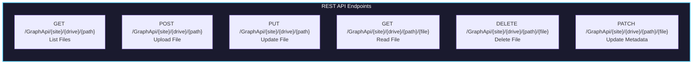
```mermaid
flowchart LR
    subgraph Endpoints["REST API Endpoints"]
        direction TB
        GET1["GET /GraphApi/{site}/{drive}/{path}<br/>List Files"]
        POST["POST /GraphApi/{site}/{drive}/{path}<br/>Upload File"]
        PUT["PUT /GraphApi/{site}/{drive}/{path}<br/>Update File"]
        GET2["GET /GraphApi/{site}/{drive}/{path}/{file}<br/>Read File"]
        DELETE["DELETE /GraphApi/{site}/{drive}/{path}/{file}<br/>Delete File"]
        PATCH["PATCH /GraphApi/{site}/{drive}/{path}/{file}<br/>Update Metadata"]
    end
    
    style Endpoints fill:#1a1a2e,stroke:#4cc9f0,stroke-width:2px,color:#fff
```

### Endpoint Summary

| Method | Endpoint | Description |
|--------|----------|-------------|
| GET | `/GraphApi/{siteName}/{driveName}/{path}` | List files in folder |
| POST | `/GraphApi/{siteName}/{driveName}/{path}` | Upload new file |
| PUT | `/GraphApi/{siteName}/{driveName}/{path}` | Update existing file |
| GET | `/GraphApi/{siteName}/{driveName}/{path}/{fileName}` | Get file metadata |
| DELETE | `/GraphApi/{siteName}/{driveName}/{path}/{fileName}` | Delete file |
| PATCH | `/GraphApi/{siteName}/{driveName}/{path}/{fileName}` | Update file metadata |

### Query Parameters

The `select` query parameter allows you to specify which fields to return:

| Field | Type | Description |
|-------|------|-------------|
| `id` | string | Unique identifier for the item |
| `name` | string | File or folder name |
| `size` | long | File size in bytes |
| `webUrl` | string | URL to access the item in SharePoint |
| `createdDateTime` | datetime | When the item was created |
| `lastModifiedDateTime` | datetime | When the item was last modified |
| `file` | object | File-specific properties (null for folders) |
| `folder` | object | Folder-specific properties (null for files) |
| `parentReference` | object | Parent folder information |

**Default select query:**
```
id,name,size,webUrl,createdDateTime,lastModifiedDateTime,parentReference
```

## Testing with Bruno API Client

This project includes a collection of API requests for testing with Bruno API client.

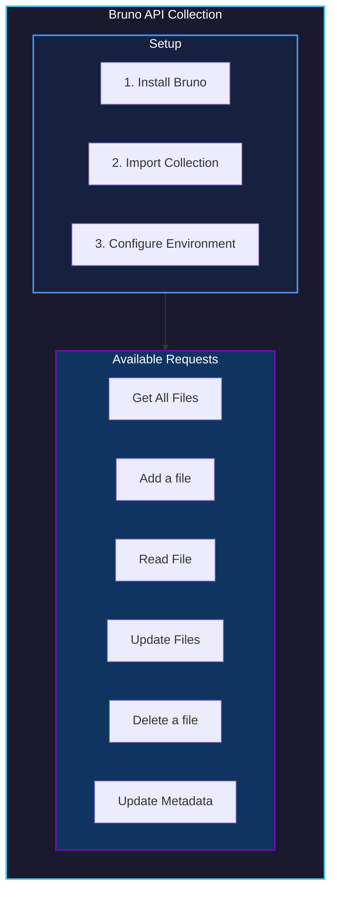
```mermaid
flowchart LR
    subgraph Bruno["Bruno API Collection"]
        direction TB
        
        subgraph Setup["Setup"]
            Install["1. Install Bruno"]
            Import["2. Import Collection"]
            Config["3. Configure Environment"]
        end
        
        subgraph Requests["Available Requests"]
            GetAll["Get All Files"]
            Add["Add a file"]
            Read["Read File"]
            Update["Update Files"]
            Delete["Delete a file"]
            Meta["Update Metadata"]
        end
        
        Setup --> Requests
    end
    
    style Bruno fill:#1a1a2e,stroke:#4cc9f0,stroke-width:2px,color:#fff
    style Setup fill:#16213e,stroke:#4895ef,stroke-width:2px,color:#fff
    style Requests fill:#0f3460,stroke:#7209b7,stroke-width:2px,color:#fff
```

### Setup

1. Install [Bruno API client](https://www.usebruno.com/downloads)
2. Open Bruno and import the `API Collection` folder
3. Configure environment variables in `environments/Local.bru`:

```
vars {
  baseUrl: https://localhost:7295
  siteName: root
  driveName: Documents
  folderPath: TestFolder
}
```

### Available Requests

| Request | Description |
|---------|-------------|
| Get All Files | Lists all files in the configured folder |
| Add a file | Uploads a new file to SharePoint |
| Read File | Gets metadata for a specific file |
| Update Files | Replaces an existing file |
| Delete a file | Removes a file from SharePoint |
| Update Metadata | Updates file properties |

## Troubleshooting

### Troubleshooting Decision Tree

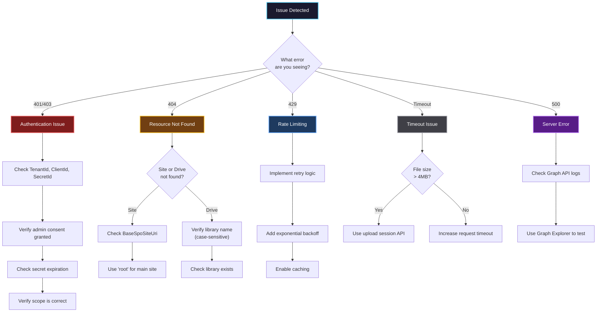
```mermaid
flowchart TB
    Start["Issue Detected"] --> Q1{"What error<br/>are you seeing?"}
    
    Q1 -->|"401/403"| Auth["Authentication Issue"]
    Q1 -->|"404"| NotFound["Resource Not Found"]
    Q1 -->|"429"| RateLimit["Rate Limiting"]
    Q1 -->|"Timeout"| Timeout["Timeout Issue"]
    Q1 -->|"500"| Server["Server Error"]
    
    Auth --> A1["Check TenantId, ClientId, SecretId"]
    A1 --> A2["Verify admin consent granted"]
    A2 --> A3["Check secret expiration"]
    A3 --> A4["Verify scope is correct"]
    
    NotFound --> N1{"Site or Drive<br/>not found?"}
    N1 -->|"Site"| N2["Check BaseSpoSiteUri"]
    N1 -->|"Drive"| N3["Verify library name<br/>(case-sensitive)"]
    N2 --> N4["Use 'root' for main site"]
    N3 --> N5["Check library exists"]
    
    RateLimit --> R1["Implement retry logic"]
    R1 --> R2["Add exponential backoff"]
    R2 --> R3["Enable caching"]
    
    Timeout --> T1{"File size<br/>> 4MB?"}
    T1 -->|"Yes"| T2["Use upload session API"]
    T1 -->|"No"| T3["Increase request timeout"]
    
    Server --> S1["Check Graph API logs"]
    S1 --> S2["Use Graph Explorer to test"]
    
    style Start fill:#1a1a2e,stroke:#4cc9f0,stroke-width:2px,color:#fff
    style Auth fill:#7f1d1d,stroke:#f87171,stroke-width:2px,color:#fff
    style NotFound fill:#713f12,stroke:#fbbf24,stroke-width:2px,color:#fff
    style RateLimit fill:#1e3a5f,stroke:#60a5fa,stroke-width:2px,color:#fff
    style Timeout fill:#3f3f46,stroke:#a1a1aa,stroke-width:2px,color:#fff
    style Server fill:#581c87,stroke:#c084fc,stroke-width:2px,color:#fff
```

### Common Issues

#### 1. Authentication Errors

**Symptom:** `401 Unauthorized` or `403 Forbidden` responses

**Solutions:**
- Verify `TenantId`, `ClientId`, and `SecretId` in `appsettings.json`
- Ensure admin consent is granted for API permissions
- Check that the client secret hasn't expired
- Verify the `Scope` is set to `https://graph.microsoft.com/.default`

#### 2. Site Not Found

**Symptom:** `404 Not Found` when accessing a site

**Solutions:**
- Verify the `BaseSpoSiteUri` matches your SharePoint tenant URL
- Check that the site name is correct (use `root` for the main site)
- Ensure the app has access to the specific SharePoint site

#### 3. Drive Not Found

**Symptom:** Error stating drive not found

**Solutions:**
- Verify the document library name exactly matches SharePoint (case-sensitive)
- Common library names: `Documents`, `Shared Documents`
- Check that the library exists in the specified site

#### 4. Rate Limiting

**Symptom:** `429 Too Many Requests` responses

**Solutions:**
- Implement retry logic with exponential backoff
- Reduce frequency of API calls
- Use caching (already implemented for sites/drives)

#### 5. Large File Upload Failures

**Symptom:** Timeout or failure when uploading large files

**Solutions:**
- Files over 4MB should use the upload session API (not currently implemented)
- Consider chunked uploads for large files
- Increase request timeouts if needed

### Debugging Tips

1. **Enable detailed logging** in `appsettings.Development.json`:
```json
{
  "Logging": {
    "LogLevel": {
      "Default": "Debug",
      "Spo.GraphApi": "Debug"
    }
  }
}
```

2. **Check Graph API responses** - The `GraphApiException` includes the full error response from Microsoft Graph

3. **Use Graph Explorer** - Test queries directly at [Graph Explorer](https://developer.microsoft.com/graph/graph-explorer)

## Additional Resources

### Microsoft Graph API Documentation

- [Microsoft Graph API Overview](https://learn.microsoft.com/graph/overview)
- [Working with SharePoint Sites](https://learn.microsoft.com/graph/api/resources/sharepoint)
- [Drive Resource](https://learn.microsoft.com/graph/api/resources/drive)
- [DriveItem Resource](https://learn.microsoft.com/graph/api/resources/driveitem)
- [Uploading Files to OneDrive/SharePoint](https://learn.microsoft.com/graph/api/driveitem-put-content)

### Azure AD / Entra ID

- [Register an Application](https://learn.microsoft.com/azure/active-directory/develop/quickstart-register-app)
- [Client Credentials Flow](https://learn.microsoft.com/azure/active-directory/develop/v2-oauth2-client-creds-grant-flow)
- [Microsoft Graph Permissions Reference](https://learn.microsoft.com/graph/permissions-reference)

## Contributing

Contributions are welcome! If you find a bug or have a feature request, feel free to open an issue or submit a pull request.

1. Fork the repository
2. Create your feature branch (`git checkout -b feature/amazing-feature`)
3. Commit your changes (`git commit -m 'Add some amazing feature'`)
4. Push to the branch (`git push origin feature/amazing-feature`)
5. Open a Pull Request

## License

This project is licensed under the MIT License. See the [LICENSE](LICENSE.txt) file for details.

## Contact

For any inquiries or support, please contact [nitin27may@gmail.com](mailto:nitin27may@gmail.com).

---

Built with ❤️ using .NET 10 and Microsoft Graph API.

